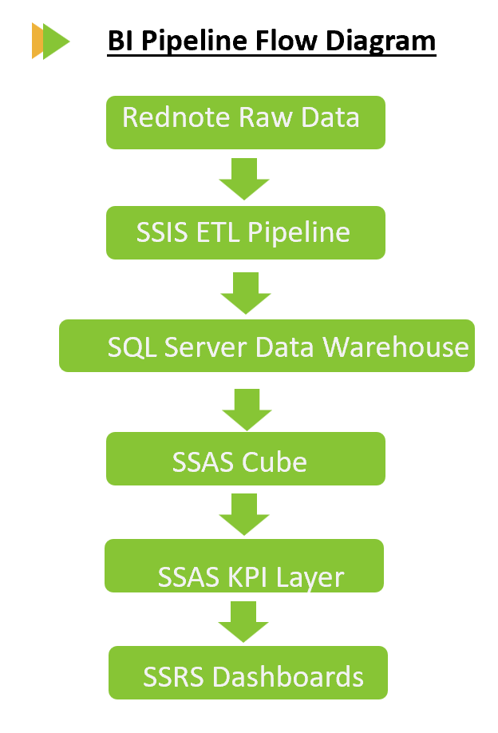

# IDS521 Rednote BI System

This repository reorganizes my IDS521 final project into a structured business intelligence portfolio.

The project builds an end-to-end BI workflow for Rednote restaurant content analytics using SQL Server, SSIS, SSAS, and SSRS.

# System Architecture



# BI Pipeline

```text
Rednote Raw Data
        ↓
SSIS ETL Pipeline
        ↓
SQL Server Data Warehouse
        ↓
SSAS Cube
        ↓
SSAS KPI Layer
        ↓
SSRS Dashboards

```

# Project Structure
IDS521-Rednote-BI-System/

├── docs/

│   └── system flow.png

├── final_report/

├── SQL/

│   ├── Full SQLQuery.sql

│   ├── cuisine_performance.sql

│   ├── pricing_strategy.sql

│   ├── content_effectiveness.sql

│   ├── creative_roi.sql

│   ├── posting_schedule.sql

│   └── overview.md

├── SSIS/

│   ├── screenshots/

│   └── overview.md

├── SSAS/

│   ├── screenshots/

│   └── overview.md

├── SSRS/

│   ├── screenshots/

│   └── overview.md

├── src/

│   └── bi_export.py

├── README.md

└── .gitignore

# Business Objective

The objective of this BI system is to transform Rednote restaurant post data into a structured reporting system that supports business questions around:

cuisine market performance

pricing strategy

content effectiveness

creative ROI

posting schedule analysis

engagement KPI monitoring

# Tech Stack

## Database & Querying

SQL Server

SQL

## ETL & Warehousing

SSIS

Star Schema Modeling

Relational Data Warehouse

## OLAP & KPI Modeling

SSAS

OLAP Cube

KPI Layer

Hierarchical Analytics

## Reporting

SSRS

Parameterized Dashboards

Business Reporting

## Supporting Tools

Python

Excel

# SQL Server Data Warehouse

The warehouse was designed using a star schema structure:

## Fact Table

FactPosts

Post-level engagement metrics

## Dimension Tables

DimRestaurant

Cuisine, pricing, popularity, and segmentation attributes

DimDate

Time hierarchy for trend and schedule analysis

Core SQL scripts are stored in the SQL/ folder.

# SSIS ETL Pipeline

SSIS was used to load analytics-ready datasets into SQL Server warehouse tables.

Main ETL steps:

Import CSV files using Flat File Source

Standardize data types using Data Conversion

Load DimDate

Load DimRestaurant

Load FactPosts

Validate warehouse row counts

The ETL pipeline also handles:

Unicode compatibility

Data type conversion

Null value normalization

Duplicate prevention

# SSAS Cube and KPI Layer

SSAS was used to create an OLAP cube for multidimensional engagement analysis.

The cube supports analysis across:

Cuisine type

Pricing level

Restaurant popularity

Posting date

Content structure

Engagement metrics

The KPI layer evaluates weighted engagement performance using categories such as:

Strong

Acceptable

Weak

# KPI Logic

The core engagement KPI is based on weighted engagement:

Weighted Engagement = Like Count + Save Count + 4 × Comment Count

Comments receive higher weighting because they typically represent deeper user interaction than likes or saves.

# SSRS Dashboards

SSRS dashboards translate SQL and cube outputs into business-facing reports.

Dashboard themes include:

Market Intelligence

Pricing Strategy

Content Effectiveness

Creative ROI

Posting Schedule

Parameterized reports allow users to dynamically filter dashboards using dimensions such as:

Cuisine Type

Price Level

# Example Findings

Key findings from the BI system include:

Italian and Filipino cuisine categories generated higher engagement efficiency than dominant mainstream categories.

Medium-priced restaurants outperformed low-priced restaurants in weighted engagement.

Some niche content structures demonstrated stronger engagement performance.

Weekend posting periods generated stronger weighted engagement than midweek periods.

# Repository Purpose

This repository demonstrates practical experience in:

SQL Server data warehouse design

SSIS ETL workflow development

SSAS cube and KPI modeling

SSRS dashboard reporting

Dimensional modeling

Business intelligence system architecture

Strategic analytics from social content data

# Notes

This repository is intended for analytics portfolio and educational purposes.

Large build outputs, temporary files, and environment files are excluded using .gitignore.